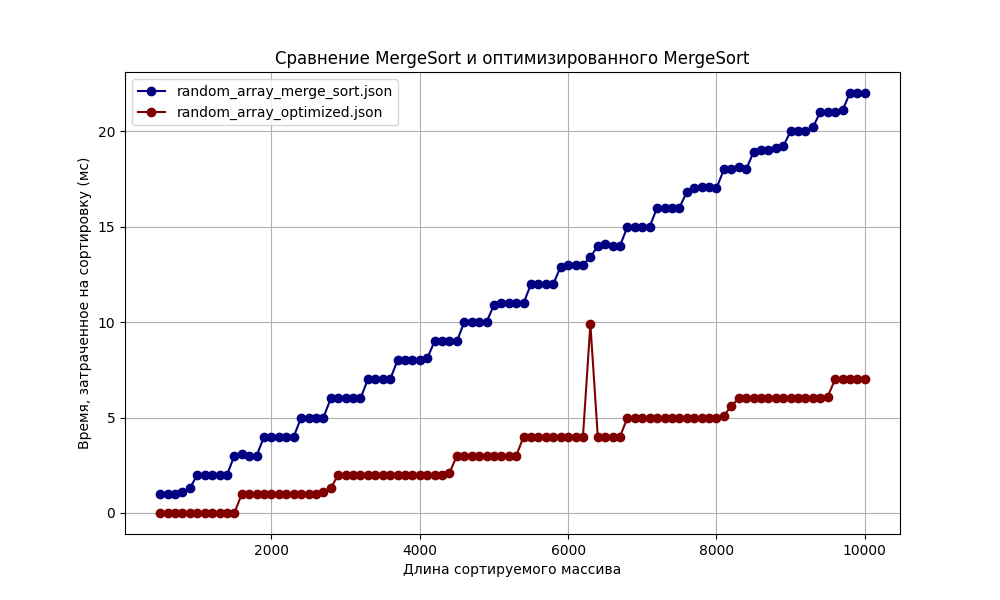
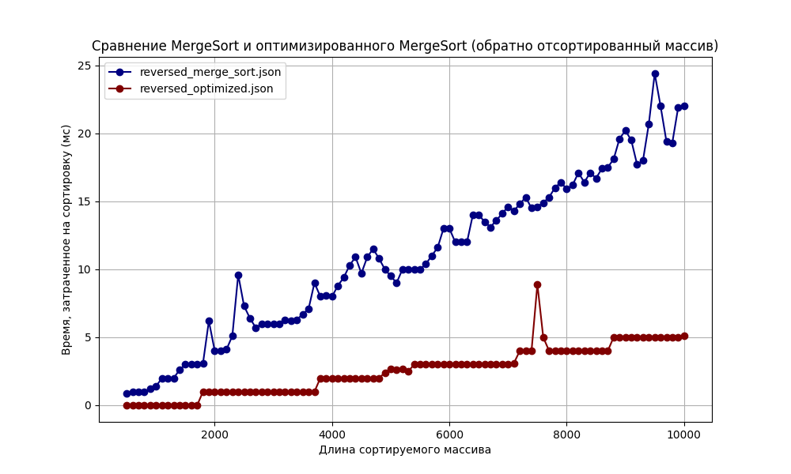

# Анализ Merge+Insertion Sort

Реализовано 2 алгоритма MergeSort и Merge+Insertion Sort, оба алгоритма поддерживают сортировку любых сравнимых типов — `A2i/utils/MergeSort.cpp`.

MergeSort — стандартная рекурсивная (с выделением дополнительной памяти)
Merge+Insertion Sort (Timsort) — гибридная, на массивах малого размера переключается на Insertion Sort

> `A2i/utils/ArrayGenerator.cpp` ArrayGenerator – класс используется для генерации тестовых массивов, заполненных целыми числами, со следующими характеристиками:
> 1. Массивы, которые заполнены случайными значениями в некотором диапазоне.
> 2. Массивы, которые отсортированы в обратном порядке по невозрастанию (отсортированы в обратном порядке).
> 3. Массивы, которые <<почти>> отсортированы. Их можно получить, обменяв местами небольшое количество пар элементов в полностью отсортированном массиве.

## Подготовка тестовых данных

Размер массивов — от 500 до 10000 с шагом 100 и диапазон случайных значений — от 0 до 6000 (целые)

> Генерируется массив размера 10000, для тестирования на массивах меньшего размера берется подмассив из исходого.

При подготовке массивов, которые <<почти>> отсортированы, использовалось **302** перестановки. <br>

## Тестирование

> Реализация **SortTester** — `A2i/utils/SortTester.cpp`

Для замера времени работы каждого из алгоритмов использовался следующий код:

```c++
template<typename Func, typename... Args>
void SortTester::ProcessSort(std::vector<int>& generated_nums, Func func) {
  std::vector<std::pair<int, double>> measurements;
  for (int sub_size = 500; sub_size <= 10000; sub_size += 100) {
    double sum = 0;
    for (int i = 0; i < _measurements_count; ++i) {
      auto sub_nums = ArrayGenerator::GetSubArray(generated_nums, sub_size);
      sum += ProcessTime(func, sub_nums.begin(), sub_nums.end());
    }
    double average_time = sum / _measurements_count;
    measurements.emplace_back(sub_size, average_time);
  }
  Out(measurements);
}

template<typename Func, typename... Args>
double SortTester::ProcessTime(Func func, Args &&... args) {
  auto start = std::chrono::high_resolution_clock::now();
  func(std::forward<Args>(args)...);
  auto elapsed = std::chrono::high_resolution_clock::now() - start;
  return (double)std::chrono::duration_cast<std::chrono::milliseconds>(elapsed).count();
}
```

Функия сортировки и параметры передаются через аргументы функции `ProcessTime`.
Также вычисляется среднее время, затраченное на выполнение алгоритма за `_measurements_count` раз.
В ходе тестирования значение `_measurements_count` было установлено на 10.
Единицы измерения — миллисекунды.

Такой подход гарантируется справедливость оценки, так как алгоритмы выполняются в одинаковых условиях.
Перед выполнением каждого теста создается новый массив.

Также для удобства построения графиков результаты тестирования выводятся в формате `json`.

## Построение графиков

Для построения графиков использовался python, исходный код — `vizualizer`. <br>
Данные, использованные для построения графиков — `vizualizer/assets`. <br>
Для наглядности графики результатов тестирования MergeSort и Merge+Insertion Sort совмещены.

## Сравнение алгоритмов

1. Массивы, которые заполнены случайными значениями в диапазоне [0; 6000].



Оптимизированный алгоритм справляется в 3 раза быстрее.
Пороговое значение для MergeSort — 22 мс, пороговое значение для Merge+InsertionSort – 7 мс (если не учитывать одно значение 9.9 мс, обоснование будет после завершения анализа).

2. Массивы, которые отсортированы в обратном порядке по невозрастанию (отсортированы в обратном порядке).



Оптимизированный алгоритм справляется в 4 раза быстрее.
Пороговое значение для MergeSort — 22-25 мс, пороговое значение для Merge+InsertionSort – 5 мс.

Оба алгоритма справились лучше, чем в предыдущем пункте. Хотя для Merge+InsertionSort это выглядит неожиданно.
Сортировка массива, отсортированного в обратном порядке — это худший случай для InsertionSort, с ассимптотикой O(n^2).
При этом для уже отсортированного массива, InsertionSort не будет менять элементы местами и пройдет за линию O(n).

Это можно обосновать предсказуемостью действий CPU и эффективность кэша (внутреннее устройство железа).
Подробнее об этом можно почитать здесь [Branch predictor](https://en.wikipedia.org/wiki/Branch_predictor).

3. Массивы, которые <<почти>> отсортированы. 302 перестановки в исходном массиве с 10000 значений.


Также, как и в предыдущих пунктах гибридный подход выполняется быстрее. Разница примерно в 3-4 раза.

## Вывод

На всех графиках заметно, что Merge+InsertionSort работае быстрее обычного MergeSort. Такую сортировку также называют TimSort. Это эффективный подход для сортировки массивов, используемый во многих ЯП.

С помощью ручного тестирования, найдено пороговое значение для перехода на сортировку вставками, оно находится в диапазоне от 15 до 30.
Для более точного поиска порогового значения, необходимо провести точную оценку работы каждого из алгоритмов. И как показано на практике, существуют и другие показатели из-за которых тот или иной алгоритм может работать быстрее.

Время работы MergeSort – на 3 графиках примерно одинаковое, это свидетельствует о независимости скорости и порядка элементов.
Merge+InsertionSort зависит от расположения элементов внутри массива.

> На некоторых графиках видны сильные колебания значений по сравнению с соседними значениями. На это влияет внутреннее устройство оборудования, используемого для тестирования.
